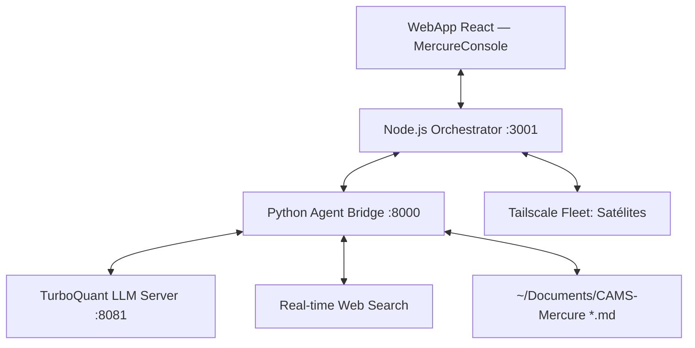

# CAMS Mercure ⚗️
### *Federated Intelligence, Semantic Compression & Personal Knowledge Management*

CAMS Mercure es un ecosistema de inteligencia distribuida que transforma tu memoria personal en una red viva y federada. Múltiples dispositivos (PC, móvil, Raspberry Pi) colaboran para construir conocimiento usando modelos de lenguaje local, sin depender de servicios en la nube.

El nombre rinde homenaje al dios Mercurio — mensajero entre mundos — y al azogue, el metal líquido que fluye y se transforma. Como el azogue, el conocimiento en CAMS se destila, se comprime y circula entre dispositivos hasta alcanzar su forma más pura.

---

## 🏛️ Arquitectura del Sistema



| Componente | Puerto | Función |
|---|---|---|
| **MercureConsole** (React) | 5173 dev / 3001 prod | Interfaz de usuario |
| **Orquestador** (Node.js) | 3001 | Sistema nervioso central |
| **Bridge de Agentes** (Python) | 8000 | Lógica RAG y compresión semántica |
| **Motor LLM** (TurboQuant) | 8081 | Inferencia local |

---

## 🎙️ Los Agentes (Consola Principal)

CAMS ofrece cuatro modos de consulta especializados:

### 📚 El Bibliotecario (RAG Aislado)
Tu guardián de conocimiento offline. Lee el **índice troglodita (Caveman)** generado por el Wiki Scanner. Está aislado de internet para proteger tu privacidad y **no inventa datos**, solo expande la información estructurada que encuentra en tus bóvedas.

### 🔍 El Investigador (Sinergia Local / Web)
Agente de contraste. Realiza búsquedas online globales (vía API SearxNG) y **cruza esta información en tiempo real con tu índice Caveman**. Ideal para validar tus anotaciones personales contra el conocimiento actual de internet y encontrar contradicciones.

### 🧭 El Explorador (Conversación Ágil)
Modo conversacional fluido y liviano. Tiene acceso a la web (SearxNG) y lee exclusivamente tu carpeta `/perfil` para imitar el tono que desees. **No carga bóvedas de conocimiento local** a menos que se lo exijas explícitamente, ahorrando GPU.

### ⚔️ El Ágora (Debate Socrático)
El Maestro orquesta un diálogo entre el Bibliotecario (verdad local), el Investigador (verdad externa) y el Explorador (visión personal). Discuten, se enfrentan y el Maestro destila una única Conclusión Sintetizada.

---

## 📁 Wiki LLM Scanner

Desde la barra de control de la consola, el botón **📁 Wiki** abre un panel para indexar cualquier carpeta de archivos `.md`:

1. Introduce la ruta de tu bóveda (Obsidian, Logseq, Joplin, VS Code…).
2. Pulsa **Escanear** — el sistema indexa todos los archivos `.md` recursivamente.
3. El contenido queda disponible como contexto RAG para el Bibliotecario e Investigador.

Compatible con cualquier editor de Markdown. No es necesario usar Obsidian.

---

## 🔒 Backup Silencioso (Anti-Pérdida de Respuestas)

Cada respuesta generada se sobreescribe automáticamente en:

```
~/Documents/CAMS-Mercure/backups/{modo}.md
```

Un archivo por modo: `bibliotecario.md`, `investigador.md`, `explorador.md`, `debate.md`, `agora.md`.

Si la red falla y la respuesta no llega a la pantalla, el botón **🔄 Recuperar respuesta anterior** la restaura instantáneamente.

---

## 🏛️ El Ágora Cuántica (v5.0)

El Ágora es el corazón federado de CAMS: un punto de encuentro donde diferentes IAs, en diferentes dispositivos, razonan juntas sobre un mismo tema.

### Flujo de un Debate Cuántico

```
1. PREGUNTA  ──► Maestro (PC) + Satélites razonan en PARALELO
                        │
2. SÍNTESIS  ◄──  Maestro recibe todos los razonamientos
                        │
3. DIRECCIÓN ──► Maestro emite el punto clave a profundizar
                        │
4. CICLOS    ◄──► Satélites responden · Maestro re-sintetiza
             (repetir N veces, configurable 1-5 desde la UI)
                        │
5. CONCLUSIÓN ◄── Maestro genera la síntesis final sin prejuicio de origen
```

> **Principio de diseño**: No siempre el modelo más grande produce la mejor respuesta. El Maestro sintetiza sin prejuicio de origen.

---

## 🍖 Protocolo Troglodita (Caveman Compression)

Para operar en dispositivos con ventanas de contexto limitadas, CAMS implementa el **Protocolo Caveman**:

- Reduce el contexto ~60% eliminando gramática redundante, conservando solo sustantivos y verbos de acción.
- Permite debates complejos en hardware modesto (móviles, GPUs de gama media).
- **Inspiración**: [wilpel/caveman-compression](https://github.com/wilpel/caveman-compression)

---

## ⚡ Rendimiento (con TurboQuant Plus)

> Hardware de referencia: **RTX 3050 8GB VRAM** · Modelo: **Qwen 3.5 9B Q4_K_M GGUF**

| Métrica | Valor |
|---|---|
| Prompt Evaluation | **1066 tokens/seg** |
| Generación | **31.45 tokens/seg** |
| Latencia de muestreo | **0.16 ms** |

Motor: [TheTom/turboquant_plus](https://github.com/TheTom/turboquant_plus)

---

## 📖 Inspiración

- **Andrej Karpathy** — [LLM Wiki Gist](https://gist.github.com/karpathy/442a6bf555914893e9891c11519de94f): El modelo como sistema operativo de conocimiento personal.
- **wilpel** — [caveman-compression](https://github.com/wilpel/caveman-compression): Compresión semántica para modelos pequeños.
- **TheTom** — [turboquant_plus](https://github.com/TheTom/turboquant_plus): Motor de inferencia optimizado para GPUs de gama media.

---

## 🛠️ Instalación

### Prerequisitos
- **Python 3.10+** y **Node.js 18+**
- GPU con soporte CUDA (o CPU)
- [TurboQuant Plus](https://github.com/TheTom/turboquant_plus) compilado
- [Tailscale](https://tailscale.com/) para conectar satélites *(opcional)*

---

### ⚠️ IMPORTANTE: Configuración de Búsqueda Web (SearxNG)
El **Investigador** y el **Explorador** requieren un motor de búsqueda web para funcionar de forma autónoma, con el objetivo de cruzar la red evitando los bloqueos (Rate-Limits) de corporaciones como Google o Bing. 

Por defecto, el código (en `bridge/server.py`) utiliza la siguiente lógica para conectar con tu buscador:

```python
def web_search(query):
    # Usando SearxNG o motor de búsqueda local equivalente
    try:
        # CONFIGURA AQUÍ TU INSTANCIA DE SEARXNG (Por defecto: localhost:8080)
        # IMPORTANTE: No expongas IPs privadas públicamente en repositorios como GitHub.
        url = os.environ.get("SEARXNG_URL", "http://127.0.0.1:8080/search")
        response = requests.get(url, params={"q": query, "format": "json", "language": "es"}, timeout=7)
```

**Tú eres el responsable de instanciar y configurar tu propio buscador SearxNG.**

> 💡 **No tengo ni idea de informática, ¿cómo configuro esto?**
> CAMS Mercure está diseñado para entusiastas del conocimiento. Si este paso se te resiste, te recomendamos encarecidamente utilizar asistentes como **Claude** o **Gemini** y pedirles: *"Tengo un script en Python que hace peticiones GET a una API de SearxNG en localhost. ¿Puedes explicarme paso a paso cómo instalar SearxNG mediante Docker en mi equipo?"*.

---

### Opción A — Setup Automático ✅

```bash
git clone https://github.com/tu-usuario/cams-mercure.git
cd cams-mercure
chmod +x deployment_setup.sh
./deployment_setup.sh
```

El script detecta tu sistema (Linux / macOS / Termux), instala dependencias y crea la estructura en `~/Documents/CAMS-Mercure`.

---

### Opción B — Setup Manual

**1. Clonar**
```bash
git clone https://github.com/tu-usuario/cams-mercure.git
cd cams-mercure
```

**2. Bridge (Python)**
```bash
cd bridge
pip3 install fastapi uvicorn requests
python3 server.py
```

**3. Orquestador + WebApp (Node.js)**
```bash
cd webapp
npm install
npm start          # Producción en :3001
# npm run dev      # Desarrollo en :5173
```

**4. Configurar nodos Tailscale**

Edita `webapp/nodes.json`:
```json
{
  "nodes": [
    { "id": "master", "name": "PC Maestro", "ip": "localhost", "role": "master" },
    { "id": "node1",  "name": "GDispositivo 1",  "ip": "100.X.Y.Z", "role": "student" },
    { "id": "node2",  "name": "Dispositivo 2",     "ip": "100.X.Y.Z", "role": "student" }
  ]
}
```

**5. Motor LLM**

Usa el selector en la interfaz para elegir tu modelo `.gguf` y pulsa **Encender Cerebro**. También puedes lanzarlo directamente:
```bash
llama-server -m /ruta/a/modelo.gguf -c 33000 --port 8081
```

---

### Despliegue de Satélites (Móvil / Raspberry Pi)

```bash
# En el dispositivo satélite (Termux o Linux)
chmod +x scripts/setup_satellite.sh
./scripts/setup_satellite.sh
./cams-node/start_node.sh
```

En Raspberry Pi, el script compila `llama-server` desde fuente con CMake. En Termux usa los paquetes disponibles.

---

### Tu Bóveda de Conocimiento

CAMS crea automáticamente esta estructura en `~/Documents/CAMS-Mercure/`:

```
~/Documents/CAMS-Mercure/
├── agoras/          ← Debates del Ágora Cuántica (*.md)
├── respuestas/      ← Respuestas guardadas manualmente
├── recursos/        ← Archivos adjuntos de contexto
├── backups/         ← Última respuesta por modo (sobreescrita)
│   ├── bibliotecario.md
│   └── ...
└── perfil/          ← Plantillas de configuración para los agentes
    ├── perfil-de-usuario.md
    ├── perfil-de-empresa.md
    └── perfil-de-hardware.md
```

Abre esta carpeta con cualquier editor Markdown: **Obsidian**, VS Code, Logseq, Typora, Joplin…

---

## 🤖 Anexo: Sincronización con Asistentes IT ('Agentic AI')

CAMS Mercure nace para trabajar en perfecta simbiosis con asistentes generadores de código de bajo nivel como **Google Antigravity**, **Claude Code** o **Cline** (VS Code).

### La Estrategia del Meta-Cerebro Compartido
Como el Wiki Scanner (`📁 Wiki`) de CAMS Mercure es capaz de indexar tanto archivos `.md` como código fuente (`.js`, `.json`, `.py`, `.css`, `.sh`), puedes pedirle a tu agente IA externo que documente sus pasos directamente en la bóveda de Mercure:

1. **Crea una Bóveda Puente:** Dentro de tu directorio `CAMS-Mercure/` crea una carpeta dedicada, por ejemplo `/Agentic_Dev_Notes`.
2. **Logueo Autónomo:** Pídele a tu IA de programación que registre todos sus *pull requests*, decisiones de arquitectura o refactorizaciones en un archivo Markdown dentro de esa carpeta.
3. **Escaneo CAMS:** Abre la interfaz web de Mercure, busca esa carpeta en el panel **📁 Wiki** e indéxala.

**El Meta-Resultado:** 
Tu Inteligencia Artificial local ahora *comprende* cómo fue programada por otra Inteligencia Artificial. Al consultar al **Arquitecto IT** o al **Bibliotecario** en CAMS Mercure, estos no solo tendrán acceso a tu código actual, sino a las mismísimas justificaciones y pensamientos arquitectónicos que dejó el programador "Agentic" original. 

---

**⚗️ El azogue fluye. La inteligencia se destila. Bienvenido a CAMS Mercure.**
